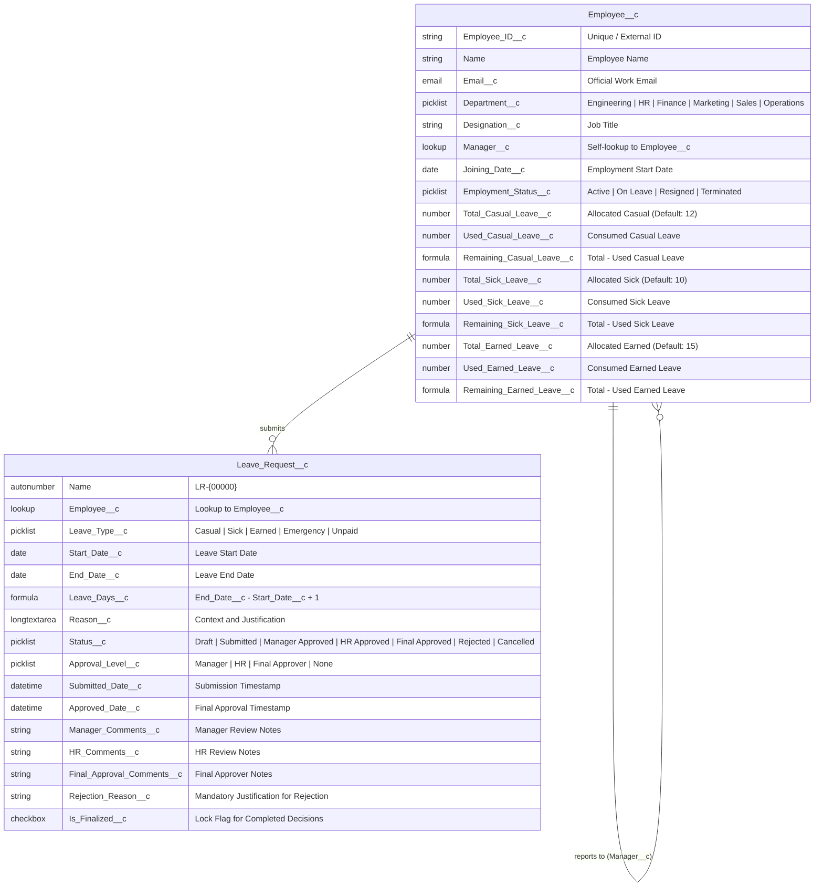
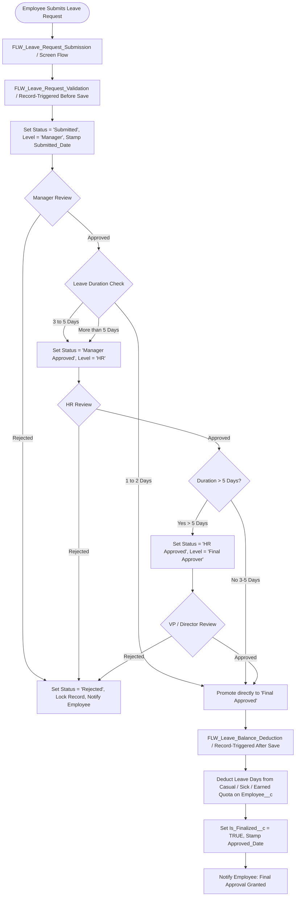

# 🌿 Salesforce Employee Leave & HR Management System

> **Enterprise-grade Declarative HR Solution & Interactive Portfolio Demonstration**  
> Built with Salesforce DX Source Metadata (Objects, Validation Rules, Record-Triggered & Screen Flows, Reports, Dashboards, Permission Sets) and an accompanying humanized React/TypeScript interactive demonstration interface.

[](https://developer.salesforce.com/docs/atlas.en-us.sfdx_dev.meta/sfdx_dev)
[](https://trailhead.salesforce.com/)
[](https://vitejs.dev/)
[](https://www.typescriptlang.org/)
[](LICENSE)

---

## 📌 Executive Summary & Problem Statement

In modern organizations, leave administration frequently suffers from manual email bottlenecks, disconnected spreadsheets, delayed manager reviews, and lack of real-time balance transparency. This creates administrative overhead for HR and compliance friction for employees.

The **Salesforce Employee Leave & HR Management System** solves this by establishing a centralized, audit-compliant, and fully automated employee self-service platform. Built entirely using **Salesforce declarative capabilities (No Apex / No custom LWC required)**, this solution showcases how powerful native Salesforce architecture can streamline workforce operations.

---

## 🏛️ Two-Layer Project Strategy

This repository is designed with two distinct, complementary layers:

```
┌─────────────────────────────────────────────────────────────────────────┐
│                      TWO-LAYER PROJECT ARCHITECTURE                     │
├─────────────────────────────────────┬───────────────────────────────────┤
│    LAYER A: REAL SALESFORCE DX      │   LAYER B: PORTFOLIO DEMO APP     │
│   (force-app/main/default/)         │   (src/ - React + Vite + TS)      │
├─────────────────────────────────────┼───────────────────────────────────┤
│ • Custom Objects & Formula Fields   │ • Humanized Modern HR SaaS UI     │
│ • Validation Rules                  │ • Live Quota Deduction Simulator  │
│ • Screen & Record-Triggered Flows   │ • Multi-Stage Approval Matrix     │
│ • Conditional Multi-Tier Routing    │ • Smooth 3D Inertia Cursor        │
│ • Permission Sets & Custom Tabs     │ • 5 Realistic Personas & Roles    │
│ • 7 Salesforce Reports & Dashboard  │ • CSV Report Exports & Analytics  │
└─────────────────────────────────────┴───────────────────────────────────┘
```

1. **Layer A — Actual Salesforce Implementation (`force-app/main/default/`)**:
   Contains production-ready Salesforce DX metadata: Custom Objects (`Employee__c`, `Leave_Request__c`), Formula Fields, Validation Rules, Screen Flow (`FLW_Leave_Request_Submission`), Record-Triggered Flows for validation, duration-based approval routing, and automated leave quota deduction, Permission Sets (`PS_Employee`, `PS_Manager`, `PS_HR`), Custom App, and Reports/Dashboards.
2. **Layer B — Interactive Portfolio Demonstration (`src/`)**:
   A lightweight, accessible, and responsive web interface that simulates the employee self-service portal, approval chains, real-time balance calculations, and HR analytics. Built for recruiters and hiring managers to interactively explore the Salesforce workflow in any browser.

---

## 📊 Salesforce Data Model & Schema



---

## ⚡ Declarative Automation & Flow Architecture

The core business logic is completely orchestrated using **Salesforce Lightning Flows**:



### 1. `FLW_Leave_Request_Submission` (Screen Flow)
- Interactive self-service screen for employees to enter dates, leave types, and reasons.
- Displays dynamic duration preview and remaining quota balance.
- Executes immediate validation prior to record creation.

### 2. `FLW_Leave_Request_Validation` (Record-Triggered Flow — Before Insert)
- Sets initial `Status__c = 'Submitted'`, `Approval_Level__c = 'Manager'`, and stamps `Submitted_Date__c = $Flow.CurrentDateTime`.

### 3. `FLW_Leave_Approval_Routing` (Record-Triggered Flow — After Update)
- Implements duration-sensitive conditional approval routing:
  - **1–2 Days:** Manager approval promotes request directly to `Final Approved`.
  - **3–5 Days:** Manager approval routes request to `HR Review`. HR approval promotes to `Final Approved`.
  - **> 5 Days:** Requires 3-tier sign-off: Manager → HR → Final Approver (Leadership) → `Final Approved`.
- Rejections at any stage immediately lock the record, stamp `Rejection_Reason__c`, set `Approval_Level__c = 'None'`, and trigger employee notification without quota deduction.

### 4. `FLW_Leave_Balance_Deduction` (Record-Triggered Flow — After Save)
- Triggers when `Status__c` transitions to `Final Approved`.
- Automatically deducts `Leave_Days__c` from the appropriate quota (`Used_Casual_Leave__c`, `Used_Sick_Leave__c`, or `Used_Earned_Leave__c`).
- `Unpaid Leave` and `Emergency Leave` bypass paid quota deductions.
- Sets `Is_Finalized__c = TRUE`.

---

## 🛡️ Validation Rules

| Rule Name | Error Condition | Error Message |
| :--- | :--- | :--- |
| `VR_End_Date_Before_Start_Date` | `End_Date__c < Start_Date__c` | *End Date cannot be earlier than Start Date. Please select a valid date range.* |
| `VR_Reason_Required` | `ISBLANK(TRIM(Reason__c))` | *Please provide a brief reason for your leave request so your manager can review it.* |
| `VR_Employee_Required` | `ISBLANK(Employee__c)` | *Please select the employee record requesting time off.* |
| `VR_Prevent_Edit_After_Finalization` | `PRIORVALUE(Is_Finalized__c) = TRUE && NOT(ISCHANGED(Is_Finalized__c))` | *This leave request has already been finalized and cannot be modified. If your plans change, please submit a new request.* |

---

## 📈 Reports & Executive Dashboard

The metadata includes 7 pre-configured Salesforce reports and an executive analytics dashboard:

- `RPT_All_Leave_Requests`: Master organizational log of all time-off records.
- `RPT_Pending_Approvals`: Active queue of requests pending review.
- `RPT_Approved_Leaves`: Historical log of all finalized approvals.
- `RPT_Rejected_Leaves`: Summary of declined applications with audit reasons.
- `RPT_Department_Leave_Analysis`: Departmental leave consumption comparison.
- `RPT_Leave_Type_Analysis`: Casual vs. Sick vs. Earned distribution.
- `RPT_Monthly_Leave_Trends`: Time-series submission velocity.
- `DB_HR_Leave_Management`: Executive Dashboard containing 8 key KPI widgets (Headcount, Pending, Approvals, Department Breakdown, Type Distribution, Monthly Trends).

---

## 🔐 Security & Permission Sets

- **`PS_Employee`**: Read access to Employee profile and own quota; Create/Read access to Leave Requests.
- **`PS_Manager`**: Read access to team records; Edit/Approval access to pending Leave Requests.
- **`PS_HR`**: Full administrative CRUD permissions across Employees, Quotas, Approval Queues, Reports, and Dashboards.

---

## 🎨 Interactive Portfolio Demo Experience (Layer B)

The companion web application provides an intuitive demonstration interface:

- **Humanized Modern HR SaaS Aesthetic**: Warm palette (`#F8F5F0` background, `#FFFFFF` surface, `#252525` text, `#C96F5B` terracotta accent, `#718C72` sage green, `#C49A52` amber, `#B85C5C` muted red).
- **Smooth 3D Cursor**: Floating translucent 3D orb with physical inertia (`lerp`), velocity-linked tilt rotations (`rotateX`/`rotateY`), interactive hover scaling (1.20x), click bounce (0.85x), and subtle decaying ghost trail. (Automatically disabled on touch devices and for users with `prefers-reduced-motion: reduce`).
- **Interactive Pages**:
  - `/` — **Employee Dashboard**: Warm greeting ("Good morning, Afsana."), KPI cards, leave quota bars, recent requests timeline preview, quick actions.
  - `/leave` — **Request Time Off**: Interactive form with real-time `End - Start + 1` day calculation, live quota verification, inline validation warnings, and approval path preview.
  - `/requests` — **Leave History**: Filterable table with search, status filtering, and comprehensive detail modal with approval audit trail.
  - `/approvals` — **Approval Center**: Multi-stage approval simulator for Managers, HR, and Final Approvers with one-click approval/rejection and live quota deduction.
  - `/hr` — **HR Dashboard & Analytics**: Workforce metrics, department breakdown charts, and employee directory with leave quotas.
  - `/reports` — **Reports Hub**: Tabbed reports matching the 7 Salesforce DX reports with one-click CSV export.
  - `/settings` — **Persona & Architecture Inspector**: Switch between 5 realistic personas (Afsana Kathoon, Rahul Kumar, Priya Sharma, Arjun Kumar, Sneha Raj), switch security roles (Employee, Manager, HR), or inspect Salesforce DX XML files.

---

## 🚀 Getting Started & Local Development

### Prerequisites
- Node.js (v18+ or v20+)
- npm (v9+)
- Salesforce CLI (`sf`) *(Optional, for org deployment)*

### 1. Run the Interactive Demo Locally
```bash
# Clone repository
git clone https://github.com/Afsu03/Salesforce-Employee-Leave-HR-Management.git
cd Salesforce-Employee-Leave-HR-Management

# Install dependencies
npm install

# Start local development server
npm run dev
```
Open your browser at `http://localhost:3000` to interact with the system.

### 2. Build for Production
```bash
npm run build
```

---

## ☁️ Salesforce DX Deployment Guide

To deploy the metadata to a Salesforce Developer Edition, Scratch Org, or Sandbox:

```bash
# 1. Authorize your target Salesforce org
sf org login web --set-default --alias hrOrg

# 2. Validate metadata deployment without committing changes
sf project deploy validate --source-dir force-app

# 3. Deploy metadata to target org
sf project deploy start --source-dir force-app

# 4. Assign permission sets to your user
sf org assign permset --name PS_HR
sf org assign permset --name PS_Manager

# 5. Open the deployed application in Lightning Experience
sf org open --path /lightning/app/c__Employee_Leave_HR_Management
```

> **Note on Deployment:** If no authenticated Salesforce target org is connected locally, the metadata in `force-app/main/default/` remains fully intact, valid, and deployable whenever an org is authenticated.

---

## 💡 Declarative Design Decisions & Transparency

- **100% Declarative Automation**: Apex code and custom Lightning Web Components (LWC) were intentionally omitted. Standard Salesforce Flow Builder, Validation Rules, and Formula fields achieve complete business automation while maintaining low maintenance overhead and high auditability.
- **Quota Deduction Isolation**: Leave balances are deducted strictly upon `Final Approved` status. Rejected or in-review requests preserve employee quotas.
- **Tamper Prevention**: Finalized decisions (`Is_Finalized__c = TRUE`) are locked using declarative validation rules to prevent post-approval alterations.

---

## 👤 Author & Acknowledgments

**Afsana Kathoon**  
- GitHub: [@Afsu03](https://github.com/Afsu03)  
- Repository: [Salesforce-Employee-Leave-HR-Management](https://github.com/Afsu03/Salesforce-Employee-Leave-HR-Management)  
- Salesforce Trailhead: [Afsana Kathoon](https://trailhead.salesforce.com/)

---

*Crafted with precision using Salesforce DX & Modern Web Architecture.*
